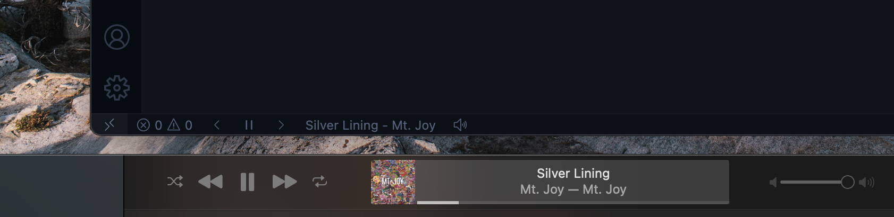

# Apple Music Player - Visual Studio Code

Apple Music client for Visual Studio Code.

## Features

- Supported Controls
  - Open Apple Music
  - Play/Pause
  - Mute/Unmute
  - Play Previous/Next Song

## Requirements

- macOS with Apple Music

## Release Notes

### 1.2.2

- Add a tooltip with track and album art information
- Fix issue with volume when muting and unmuting

### 1.2.1

- Bug fix for stopped player state

### 1.2.0

- Fix issue where player state is not syncing correctly
- Make UI more responsive to actions
- Add activation events to extension

### 1.0.1

- Update `package.json` configuration for Azure Marketplace

### 1.0.0

- Initial release
