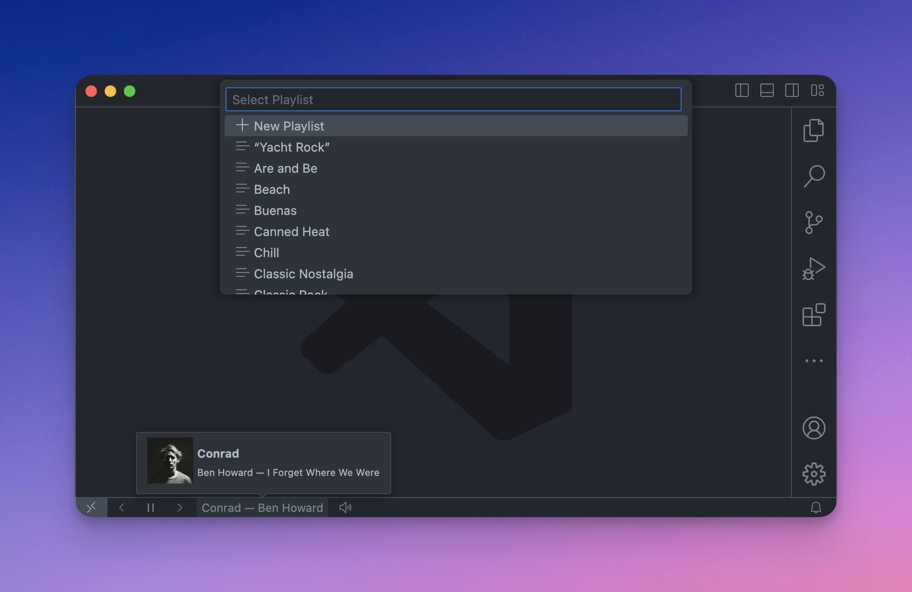

# Apple Music Player - Visual Studio Code

Apple Music client for Visual Studio Code — _only available for macOS_



## Features

- Shows the currently playing song in the status bar.
- Provides [commands](#supported-commands) for controlling Apple Music.
- Provides [keybindings](#supported-commands) for controlling Apple Music.
- Provides buttons for controlling Apple Music.
- Provides [configuration](#configuration) for the status bar items.

## Supported Commands

| Feature               | Available in Status Bar | Available as Command | Keybinding        |
| --------------------- | :---------------------: | :------------------: | ----------------- |
| Play/Pause            |           ✅            |          ✅          | `Cmd+Shift+Space` |
| Mute/Unmute           |           ✅            |          ✅          |                   |
| Previous Track        |           ✅            |          ✅          | `Cmd+Shift+Left`  |
| Next Track            |           ✅            |          ✅          | `Cmd+Shift+Right` |
| Play Playlist         |           ❌            |          ✅          |                   |
| Shuffle Playlist      |           ❌            |          ✅          |                   |
| Open                  |           ✅            |          ✅          |                   |
| Quit                  |           ❌            |          ✅          |                   |
| Preview Album Artwork |           ✅            |          ❌          |                   |
| Add to Library        |           ❌            |          ✅          |                   |
| Add to Playlist       |           ❌            |          ✅          |                   |
| Add to New Playlist   |           ❌            |          ✅          |                   |
| Play                  |           ❌            |          ✅          |                   |
| Pause                 |           ❌            |          ✅          |                   |
| Mute                  |           ❌            |          ✅          |                   |
| Unmute                |           ❌            |          ✅          |                   |
| Volume Up             |           ❌            |          ✅          | `Cmd+Shift+Up`    |
| Volume Down           |           ❌            |          ✅          | `Cmd+Shift+Down`  |
| Toggle Shuffle        |           ❌            |          ✅          |                   |
| Toggle Repeat         |           ❌            |          ✅          |                   |
| Show Player           |           ❌            |          ✅          |                   |
| Hide Player           |           ❌            |          ✅          |                   |

## Configuration

```jsonc
{
  // Show the currently playing track in the status bar.
  "vscodeAppleMusic.showTrackInStatusBar": true,
  // Time interval (in milliseconds) to update the currently playing track.
  "vscodeAppleMusic.trackUpdateInterval": 1000,
  // The step size for volume control.
  "vscodeAppleMusic.volumeStep": 6.25,
  // Show the Previous button in the status bar.
  "vscodeAppleMusic.showPreviousButton": true,
  // Show the Play/Pause button in the status bar.
  "vscodeAppleMusic.showPlayPauseButton": true,
  // Show the Next button in the status bar.
  "vscodeAppleMusic.showNextButton": true,
  // Show the Mute button in the status bar.
  "vscodeAppleMusic.showMuteButton": true
}
```

## Requirements

- macOS with Apple Music

## Release Notes

### 1.6.0

- Add 'Play Playlist'
- Add 'Shuffle Playlist'
- Migrate tooling

### 1.5.0

- Add 'Add to Library'
- Add 'Add to Playlist'
- Add ability to create a new playlist
- Add default keybindings
- Add configuration options

### 1.4.0

- Add show/hide commands
- Add quit command

### 1.3.0

- Add a ton of new commands
- Fix album artwork issue causing artwork to not display in certain cases

### 1.2.3

- Fix setInterval bug

### 1.2.2

- Add a tooltip with track and album art information
- Fix issue with volume when muting and unmuting

### 1.2.1

- Bug fix for stopped player state

### 1.2.0

- Fix issue where player state is not syncing correctly
- Make UI more responsive to actions
- Add activation events to extension

### 1.0.1

- Update `package.json` configuration for Azure Marketplace

### 1.0.0

- Initial release
